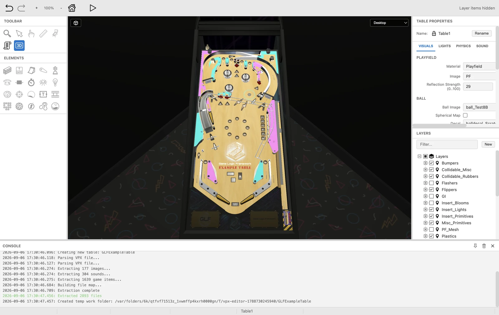
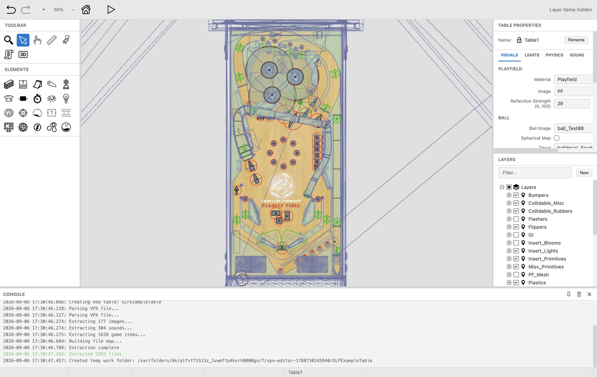
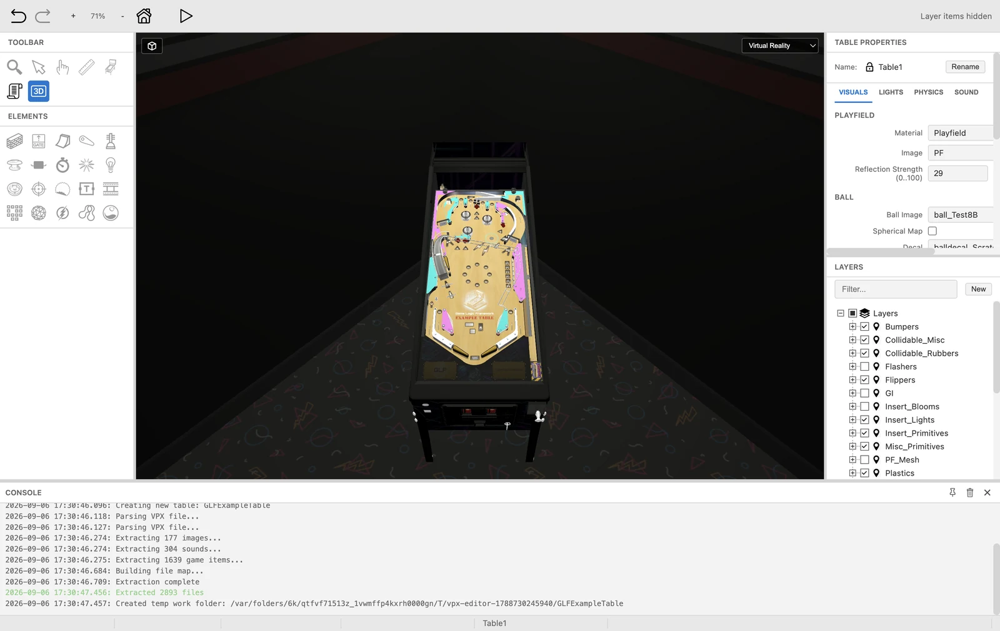
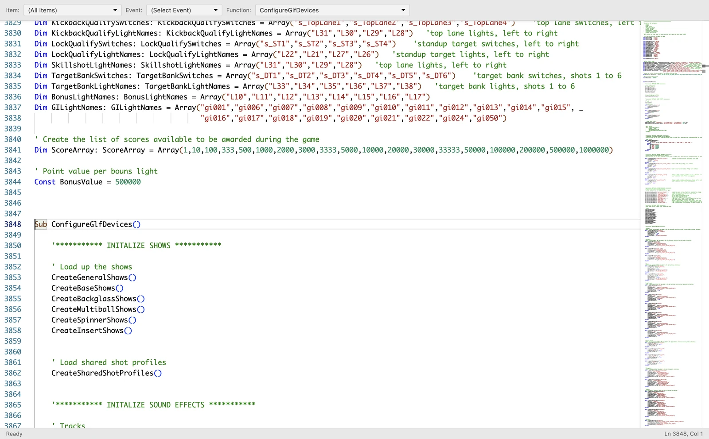
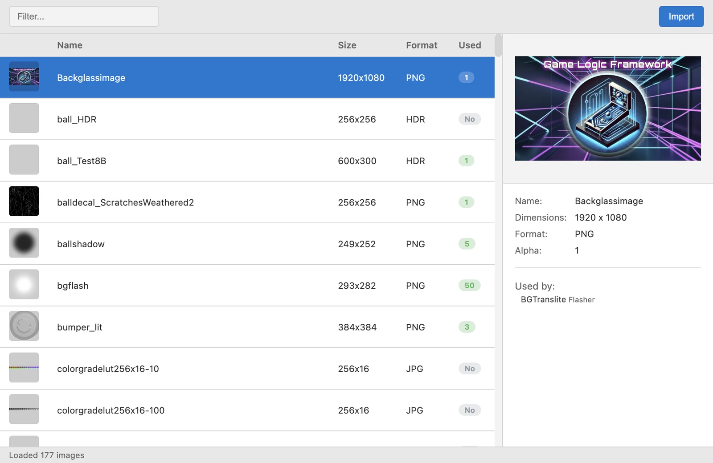
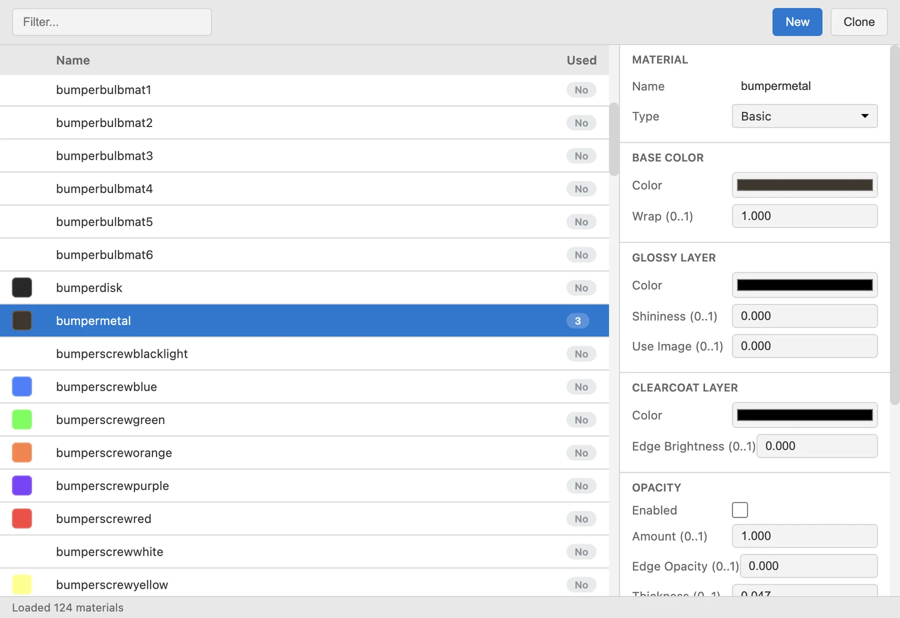
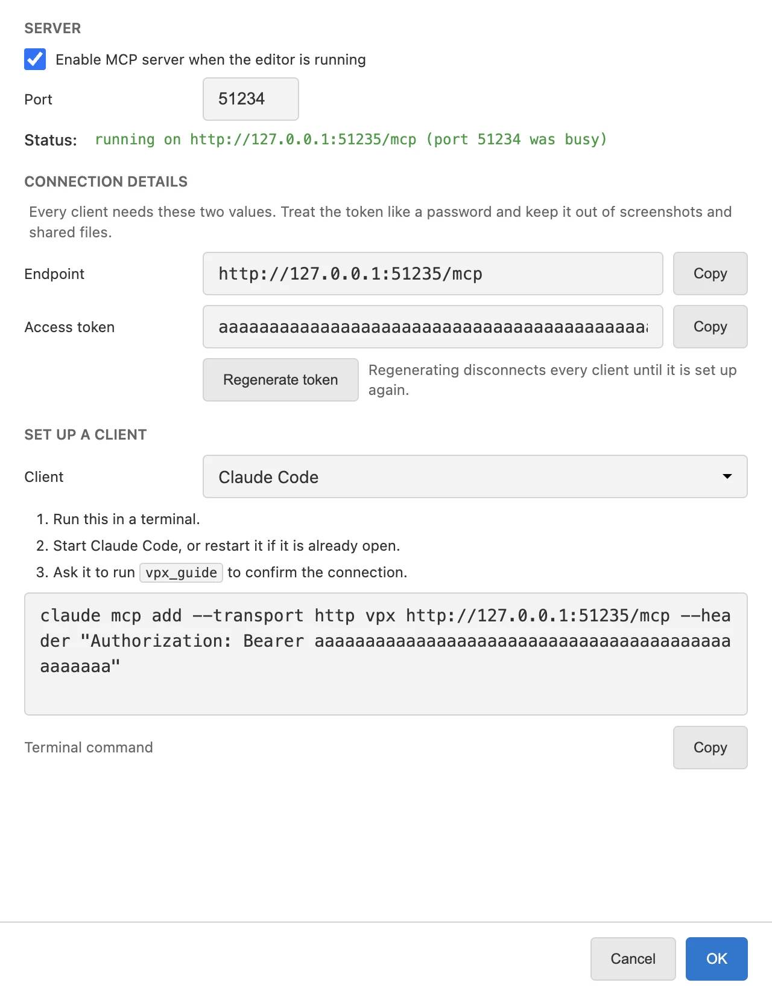

# VPX Editor

A cross-platform editor for Visual Pinball X (.vpx) table files, with a 3D preview, a script editor, and an MCP server so AI assistants can help build tables.

**[Try it in your browser](https://jsm174.github.io/vpx-editor)** - No installation required!

<p align="center">
  
</p>

## Overview

VPX Editor is a cross-platform table editor for [Visual Pinball](https://github.com/vpinball/vpinball), available as both a desktop application ([Electron](https://www.electronjs.org/)) and a web app. Built with [TypeScript](https://www.typescriptlang.org/) and [Three.js](https://threejs.org/), it uses [vpin-wasm](https://github.com/francisdb/vpin) to extract and assemble VPX files.

This project was initially created with the assistance of Claude AI.

> [!WARNING]
> **Always make a backup of your VPX files before editing!** This editor is in early development and is bound to have bugs.

> [!NOTE]
> This editor converts tables to use **Part Groups** instead of Layers, a new feature introduced in VPX 10.8.1. Tables saved with this editor require **VPinball 10.8.1 or later** to run.

## Features

### 2D Editor

<p align="center">
  
</p>

Port of the Windows VPX 2D editor:
- All playfield elements (walls, ramps, flippers, bumpers, lights, primitives, and more)
- Drag-and-drop placement, multi-select, and transform operations
- Layers panel with per-layer visibility, filtering, and drawing order
- Properties panel for every element type
- Undo and redo for every edit, including edits made by AI assistants

### 3D Preview

<p align="center">
  
</p>

- Real-time 3D rendering with Three.js
- Blender-style camera controls (see [3D Controls](#3d-controls))
- Material and texture preview
- Play Mode preview: Desktop, Full Single Screen, Cabinet, Mixed Reality, and Virtual Reality

### Script Editor

<p align="center">
  
</p>

- Monaco-based VBScript editor with syntax highlighting
- Jump to any item, event, or function from the toolbar
- Function creation

### Managers

<table align="center">
  <tr>
    <td></td>
    <td></td>
  </tr>
</table>

- Image, Sound, and Material managers with usage counts
- Dimension, Collection, and Render Probe managers

### Import and Export

- Import and export meshes as OBJ, and export the whole table as GLB for Blender
- Export a playfield blueprint image

### Quick Play

- Configure the VPinball executable path in settings
- Launch and test tables directly from the editor

### Themes

- Light and dark mode with system theme detection

### AI Assistants (MCP)

<p align="center">
  
</p>

The desktop editor runs a local [Model Context Protocol](https://modelcontextprotocol.io) server so an AI coding assistant can build and edit tables for you. Open **Tools → MCP Server → Settings…**, pick your client, and paste the command or config block it shows. Claude Code and Codex CLI are supported.

Once connected, the assistant can:
- Create a new table from a starter (a playable [GLF](https://github.com/mpcarr/vpx-glf) table or a blank one) and save it straight into the folder you are working in
- Add and modify parts, materials, images, sounds, and meshes, with previews before destructive edits
- Wire game logic with GLF devices and generate [Mission Pinball Framework](https://missionpinball.org/) hardware config
- Take screenshots of the 2D and 3D views to check placement
- Boot-test the table in VPinballX and report script errors
- Undo and redo its own edits alongside yours

See [docs/mcp/getting-started.md](docs/mcp/getting-started.md) for setup, [GLF tables](docs/mcp/glf-tables.md), and [MPF export](docs/mcp/mpf-workflow.md).

### Example Tables

File → New offers stock Visual Pinball templates, the three VPin Workshop example tables, and two GLF tables: a minimal playable tutorial and the full GLF Example Table. They are downloaded or assembled from their upstream repositories on install and are credited under [Acknowledgments](#acknowledgments).

## 3D Controls

Blender-style navigation:

| Input | Action |
|-------|--------|
| Middle-drag | Orbit camera |
| Shift + Middle-drag | Pan camera |
| Scroll wheel | Zoom |
| Numpad 1 | Front view |
| Numpad 3 | Side view |
| Numpad 7 | Top view |
| Ctrl + Numpad | Opposite views |
| Alt (hold) | Temporary orbit mode |

## Installation

Download the latest release for your platform from the [Releases](https://github.com/vpinball/vpx-editor/releases) page.

- **VPinball 10.8.1+** - Required only for playing tables from the editor

## Development

### Requirements

- **Node.js** 20+

### Getting Started

Install the node dependencies:
```bash
npm install
```

The install step also downloads the vendored scripts and assembles the example tables pinned in `resources/vendor.json` (a few hundred megabytes on a fresh checkout). Run `npm run vendor` to restore them later, or `node scripts/fetch-vendor.mjs --check` to verify them without downloading.

### Run Desktop

```bash
npm start
```

Launches the desktop app in development mode with hot reload.

### Run Web

```bash
npm run dev:web
```

Launches the web version in development mode with hot reload.

### Build Desktop

```bash
npm run make
```

Creates distributable packages for the current platform:

| Platform | Format | Architecture |
|----------|--------|--------------|
| macOS | DMG, ZIP | arm64 |
| Linux | DEB, RPM, Flatpak, ZIP | x64 |
| Windows | Squirrel Installer, ZIP | x64 |

#### Flatpak issues

If you have issues building the flatpak try this first:

```bash
flatpak --user remote-add --if-not-exists flathub https://dl.flathub.org/repo/flathub.flatpakrepo
```

To get more output during the flatpak build:

```bash
DEBUG=electron-installer-flatpak,@malept/flatpak-bundler npm run make
```

### Build Web

```bash
npm run build:web
```

Creates a production web build in `dist-web/`.

### Type Checking

```bash
npm run typecheck
```

### Code Formatting

```bash
npm run format
```

## Architecture

```
src/
├── desktop/           # Electron main process
│   └── mcp/           # MCP server, tools, and GLF/MPF library
├── web/               # Web entry point
├── platform/
│   ├── desktop/       # Desktop platform abstraction
│   └── web/           # Web platform abstraction
├── preload/           # Electron preload scripts
├── editor/            # Shared editor renderer
│   ├── components/
│   ├── meshes/
│   ├── parts/
│   └── undo/
├── features/          # Feature modules (managers, dialogs)
├── shared/            # Shared utilities
└── types/             # TypeScript definitions

docs/mcp/              # MCP setup and workflow guides
resources/vendor.json  # Pinned upstream scripts and example tables
```

## Acknowledgments

- [Visual Pinball](https://github.com/vpinball/vpinball)
- [vpin-wasm](https://github.com/francisdb/vpin)
- [Three.js](https://threejs.org/)
- [Monaco Editor](https://microsoft.github.io/monaco-editor/)

### Bundled Example Tables

The tables under File > New are downloaded or assembled at install time from their upstream repositories and are the work of their original authors:

- **VPW Example Tables** (Basic, Example, and ROM Example, v1.7.x) by the [VPin Workshop (VPW)](https://vpuniverse.com/files/file/7787-vpin-workshop-example-resource-table/) team. Extracted copies are hosted at [jsm174/vpw-example-tables](https://github.com/jsm174/vpw-example-tables); the tables remain the property of their authors, see the download page for terms.
- **GLF Tutorial Plunger** from the [VPX Game Logic Framework (GLF)](https://github.com/mpcarr/vpx-glf) by mpcarr (MIT), built on a community base table by fuzzel, jimmyfingers, jpsalas, toxie, and unclewilly with contributions from zany, ninuzzu, rothbauerw, and arngrim.
- **GLF Example Table** by apophis and flux from [mpcarr/vpx-example-glf](https://github.com/mpcarr/vpx-example-glf) (MIT).
- **Blank, Example, and Light Sequence tables** from [Visual Pinball](https://github.com/vpinball/vpinball) (GPL).

The bundled GLF framework script (`vpx-glf.vbs`) is also from [mpcarr/vpx-glf](https://github.com/mpcarr/vpx-glf) (MIT). Exact pinned commits and checksums are in `resources/vendor.json`.

## License

This project is licensed under the GNU General Public License v3.0 or later - see the [LICENSE](LICENSE) file for details.

This matches the license used by [Visual Pinball](https://github.com/vpinball/vpinball).
